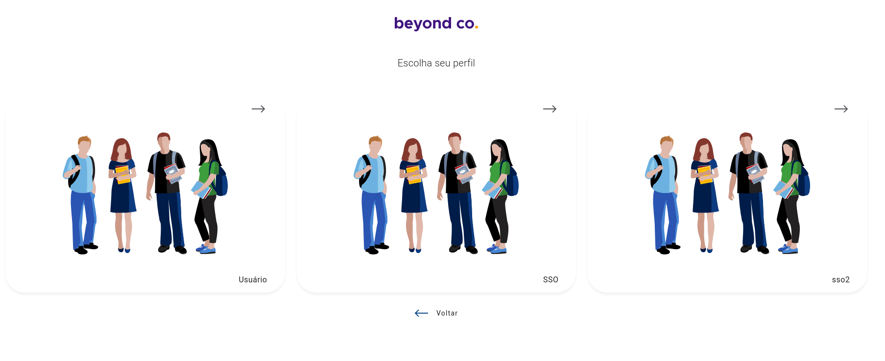

# Como adicionar uma opção de login com SSO usando SAML no Quoti

## Criar integração com o IdP fornecendo a **Assertion Consumer Service URL**

Será necessário criar uma integração com Quoti como um Service Provider (SP) / Aplicação no seu IdP. Cada IdP tem tutoriais que contém instruções pra isso, por exemplo:

1. Okta: [https://developer.okta.com/docs/guides/build-sso-integration/saml2/main/#prepare-a-saml-integration](https://developer.okta.com/docs/guides/build-sso-integration/saml2/main/#prepare-a-saml-integration)
2. Auth0: [https://auth0.com/docs/authenticate/protocols/saml/saml-sso-integrations/configure-auth0-saml-identity-provider#manually-configure-sso-integrations](https://auth0.com/docs/authenticate/protocols/saml/saml-sso-integrations/configure-auth0-saml-identity-provider#manually-configure-sso-integrations)

O importante é que, no momento de criação da integração, o seu IdP vai precisar de uma URL para o Quoti que vai ser responsável por processar a SAML Response, que pode ser chamada de **Assertion Consumer Service URL, Post-back URL** ou **Callback URL** e o valor dela deve estar no seguinte formato:

- **https://api.quoti.cloud/api/v1/**`SUA_ORGANIZAÇÂO`**/auth/login/saml/callback**

Onde `SUA_ORGANIZAÇÂO` é o slug da sua organização, por exemplo:
**https://api.quoti.cloud/api/v1/`beyond`/auth/login/saml/callback**

O slug da sua organização pode ser encontrado na URL que você usa para acessar o Quoti, que pode estar em alguns dos formatos:

- https://quoti.cloud/`SUA_ORGANIZAÇÂO`
- https://minhafaculdade.app/`SUA_ORGANIZAÇÂO`
- https://minhaescola.app/`SUA_ORGANIZAÇÂO`

## Detalhe importante

O NameID do SAML deve ser configurado para ser o email do usuário que existe no Quoti.

# Configurar SSO a partir da API do Quoti

Antes de qualquer coisa, você precisa de um **BearerStatic** de um usuário que tem o a permissão **manage.credentials** para conseguir usar a API do Quoti configurar o SSO.

Caso não tenha um BearerStatic mande um email para o suporte do Quoti pedindo.

Usuários com perfil de **suporte** ou **administrador** têm essa permissão por padrão, porém, ela também pode ser concedida a outros perfis ou grupos de usuários.

## 1. Criando uma credencial SAML para SSO

Para criar uma credencial do tipo SAML no Quoti você deve usar a API do Quoti em [https://api.quoti.cloud/api-explorer/#/Credentials/post__orgSlug__credentials/](https://api.quoti.cloud/api-explorer/#/Credentials/post__orgSlug__credentials/)

Nestes documentos existem mais informações sobre: credenciais do Quoti em geral e credenciais do tipo SAML para SSO:

- Credenciais no Quoti: [https://www.notion.so/beyondco/Credenciais-do-Backend-e9694572a46e4212a285c73caf5b226c](https://www.notion.so/Credenciais-do-Backend-e9694572a46e4212a285c73caf5b226c?pvs=21)
- Credenciais SAML: [https://www.notion.so/beyondco/SAML-191049e4a7944d949863da1012179822](https://www.notion.so/SAML-191049e4a7944d949863da1012179822?pvs=21)

Quando você criar a sua credencial, guarde o `id` dela pois vai precisar dele para criar o método de login que será usado com SSO.

## 2. Criando um Login Method para o SSO usando a credencial recentemente criada

Agora é necessário criar um método de login diferente para que usuários possam fazer login via SSO no Quoti com SAML. Basta usar essa API [https://api.quoti.cloud/api-explorer/#/Login Methods/post__orgSlug__login_methods](https://api.quoti.cloud/api-explorer/#/Login%20Methods/post__orgSlug__login_methods) fornecendo pelo menos esses campos no corpo da requisição:

- `login_method_name:` O nome do método que será mostrado aos usuários quando forem fazer login no Quoti via o SSO que você acabou de criar, por exemplo:
    
    
    
    Nessa foto temos 3 métodos de login e os nomes deles são “Usuário”, “SSO” e “sso2”
    
- `slug:` Uma string que deve identificar unicamente o seu método de login, de preferência só deve conter letras minúsculas e traços e deve ser parecido com o nome acima.
- `logo_url:` Uma URL com uma imagem que vai ser mostrada no card a ser selecionado pelo usuário. No exemplo acima, seria imagem com os estudantes.
- `field_type_id:` Esse campo deve conter o número 1.
- `credential_id:` O ID da credencial que você criou no passo acima.

Pronto! Após criar sua credencial e seu método de login, seus usuários poderão fazer login no Quoti a partir do seu IdP! A tela de login dos usuários será parecida com a da imagem acima.